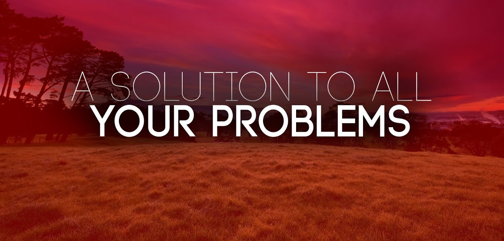

### Hi there 👋 
<!--
**CryptoLover705/CryptoLover705** is a ✨ _special_ ✨ repository because its `README.md` (this file) appears on your GitHub profile.

Here are some ideas to get you started:

- 🔭 I’m currently working on ...
- 🌱 I’m currently learning ...
- 👯 I’m looking to collaborate on ...
- 🤔 I’m looking for help with ...
- 💬 Ask me about ...
- 📫 How to reach me: ...
- 😄 Pronouns: ...
- ⚡ Fun fact: ...
-->
 
 
#### About me! 

Hi there, my name is CryptoLover. I am a full-time developer with a passion for building innovative software solutions. I have a strong background in a variety of programming languages, including Python, Java, JavaScript, and Solidity, and I am constantly seeking to expand my skills and knowledge. In my current role, I work on a range of projects, including developing smart contracts, building Android applications, and creating websites and web applications.

I am always looking for new challenges and opportunities to collaborate with other developers. Some of the projects I am currently working on include the Human Charity Coin project, the New York Coin project, and the Wrapped New York Coin project. I am also the founder of Crypto Development Services, a company that provides a range of programming and consulting services to businesses and individuals in the cryptocurrency and blockchain space.

In my free time, I enjoy staying up-to-date on the latest trends and developments in the programming world, and I am always looking for ways to improve my skills and help others learn and grow. Some of my interests and goals include working on open source projects, contributing to the development of the cryptocurrency ecosystem, and helping others learn how to code and build their own projects.

  

#### Currently the coding languages I do are as follows:

* Python
* Javascript
* Kotlin/Java (Android development) 
* React Native
* Web Development (HTML/PHP/CSS/JS)
* Application Development (C++/C#/C)
* Smart Contract Development (Solidity)

I can also do other coding languages such as `RUBY, SWIFT, TYPESCRIPT, RUST`

My Github Stats
 
 
<table>
  <tr>
    <td align="center" style="padding=0;width=50%;">
      
    </td>
    <td align="center" style="padding=0;width=50%;">
      
    </td>
  </tr>
</table>

🔭 I’m currently working on: 

* [@Human-Charity-Coin](https://github.com/Human-Charity-Coin)
* [@NewYorkCoinNYC](https://github.com/NewYorkCoinNYC)
* [@WrappedNewYorkCoin](https://github.com/Wrapped-NewYorkCoin)
* [@CryptoDevelopmentServices](https://github.com/CryptoDevelopmentServices)

 

#### Projects

Projects | Description | Status
-------- | ----------- | ------
[Crypto Development Services](https://www.cryptodevservices.com)|Repo for CDS website|Activly being maintained
[cryptoloverbots](https://cryptoloverbots.com)|Repo for my website|Activly being maintained
[Wrapped NewYorkCoin](https://wrappednyc.com)|Repo for WNYC website|Activly being maintained

### 📫 How to reach me:
If you're interested in collaborating or have any questions about my work, feel free to reach out to me on any of the following platforms:
- Telegram: [@CryptoLover705](https://telegram.me/CryptoLover705)
- Twitter: [@CryptoLover705](https://twitter.com/CryptoLover705)
- Discord: `crypto_43082` Discord ID `1157581316175437884`
- YouTube: [Crypto Lover](https://youtube.com/channel/UCvGkIPSTDHvxJGVlERpjR5A)
- Mail: support@cryptodevservices.com

#### Discord servers I run

- server 1: [Wrapped NewYorkCoin](https://discord.gg/3HjUpMkW9y)
- server 2: [CryptoDevelopmentServices](https://discord.gg/bU2teyFkv2)

### Intro video 
https://www.youtube.com/watch?v=tGFDogXpu5Q
* Views 
* Comments 
* Likes 

### Server Stats

* CryptoDevelopmentServices 
* Wrapped NewYorkCoin 

### Social Media Stats
* My Twitter 
* My GitHub 
* WNYC Twitter 
* CDS Twitter 

### Repo Stats
* Forks 
* Stars 
* StarGazers 
* Commits 
* Repo Size 
* Issues open 
* Pull Requests open 

### Solution to All your problems!

### Donation Addresses 

### Like what I do and want to support me?

Here are some donation addresses for several currencies, if there are any that isn't listed hit me up and I will add them

* `TG7Jq6dXnb6DdZHSxiY3MaNK1XbCs7N3wo` **TRX**
* `ltc1qt3cv83xd3n2unqjyf268sgck3afpg68t77s6m5` **LTC**
* `0x8936411d96eb7cd790caDc9e5984A56B9A4A7778` **BNB**
* `DNwGcUtRTkq73aZ5M591h8G6k9wiDfArhL` **DOGE**
* `tz1LZn8yp4V3NBm1dsyYmmH8RuUndtPaSw8S` **XTZ**

* `0x64eCf1f9bD4eDf6267f6f4DE42Ad0979f6127727`  **Metamask** __**This one is for all tokens on any chain**__
